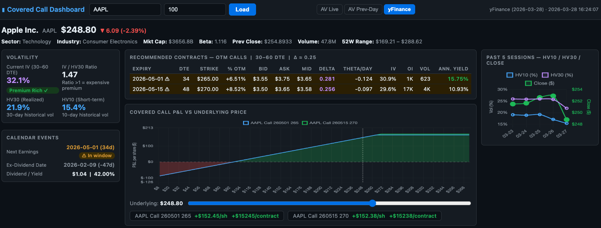

# <u>**Covered Calls Dashboard** </u>

As an options trader who writes covered calls, i used Claude to create an option trading dashboad that recommends me OTM call options. 




## Critera
It filters for contracts using 2 main criteria: 

* 30 - 60 days to expiration
* Approximately 0.25 delta

## Data sources
* Alpha Vantage API

```REALTIME_OPTIONS``` and ```HISTORICAL_OPTIONS```

  * Yahoo Finance API

## MCP Server

Alpha Vantage: https://mcp.alphavantage.co/
